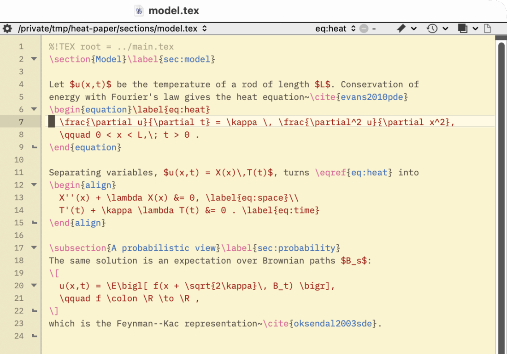

<div align="center">


# bbtex
### LaTeX package for BBEdit

[](docs/release-notes.md)
[](#a-word-on-vibe-coding)
[](bbtex.opam)
[](#requirements)
[](https://louloulibs.github.io/bbtex/)
[](LICENSE)



</div>

---

## Contents

- [What is this?](#what-is-this)
- [A word on vibe coding](#a-word-on-vibe-coding)
- [What you get](#what-you-get)
- [Requirements](#requirements)
- [Install](#install)
- [Setup](#setup)
- [Everyday use](#everyday-use)
- [Choosing the engine and main file](#choosing-the-engine-and-main-file)
- [Command line](#command-line)
- [Documentation](#documentation)
- [Development](#development)
- [License](#license)

## What is this?

I write my papers in BBEdit, and I kept missing the things LaTeXTools does for
Sublime and AUCTeX does for Emacs: hit one key to build, click an error to land
on the right line, jump between the source and the PDF, peek at an equation
without compiling the whole paper. bbtex is my attempt to get all of that in
BBEdit without changing how BBEdit feels.

It's a small OCaml binary plus a handful of scripts in BBEdit's **Scripts**
menu. This is **v0.1.0**, the first release: it works well on my machine, and
I'd love to hear where it breaks on yours.

## A word on vibe coding

This project is **totally vibe coded**. Every line of code, every test and
every page of these docs was written by an AI coding agent
([Claude Code](https://claude.com/claude-code)), with me describing what I
wanted, trying things in BBEdit, and pushing back when something felt off.

It isn't a toy, though. There are unit and cram tests, a local CI run
(`scripts/ci.sh`), real-engine checks against pdfLaTeX, XeLaTeX, LuaLaTeX and
Tectonic, and native tests that drive BBEdit itself. Still, treat it like
software written by an enthusiastic, fast, occasionally overconfident
collaborator: keep your papers in version control, and open an issue when
something looks wrong.

## What you get

- **One-key builds.** <kbd>⌘K</kbd> saves your project, compiles it with
  latexmk (pdfLaTeX, XeLaTeX, LuaLaTeX) or Tectonic, and lists errors in
  BBEdit's results browser. Click one and you're on the line.
- **Skim, both ways.** The PDF follows your cursor without stealing focus, and
  ⌘-click in Skim takes you back to the source.
- **Equation previews.** Select some math and see it rendered with your own
  preamble in a little window. It can refresh on save, or follow your
  selection as you move around.
- **A project outline.** Search sections, equations, captions and labels
  across every included file, and jump there.
- **Citation and reference pickers.** Search your `.bib` by author, title or
  year, or your labels by context, and drop the key in at the cursor.
- **Environment editing.** Change, toggle or wrap environments in one undo;
  TexLab handles completion and Go to Definition.
- **Doctor.** One command checks your TeX tools, Skim and the BBEdit setup.

## Requirements

- An Apple Silicon Mac with [BBEdit](https://www.barebones.com/products/bbedit/).
- [MacTeX](https://tug.org/mactex/) or [TinyTeX](https://yihui.org/tinytex/)
  (with Biber, use version 2.21 or later).
- [Skim](https://skim-app.sourceforge.io/) for PDFs and SyncTeX.
- Nice to have: [Tectonic](https://tectonic-typesetting.github.io/), Poppler's
  `pdftoppm` for previews (`brew install poppler`), and
  [TexLab](https://github.com/latex-lsp/texlab) for completion.

## Install

**From a release:** grab `bbtex-macos-arm64.bbpackage.zip` from
[Releases](https://github.com/LouLouLibs/bbtex/releases), unzip it, and
double-click `bbtex.bbpackage`. macOS will block the unsigned binary until you
clear the download quarantine (quit BBEdit first):

```sh
xattr -dr com.apple.quarantine ~/Library/Application\ Support/BBEdit/Packages/bbtex.bbpackage
```

Then run **Scripts → LaTeX — Doctor** to see if anything's missing. On a new Mac,
follow the [clean install walkthrough](docs/install.md).

**From source**, with [opam](https://opam.ocaml.org/doc/Install.html):

```sh
git clone https://github.com/LouLouLibs/bbtex.git
cd bbtex
opam install . --deps-only
scripts/install.sh      # builds bbtex, links it to ~/.local/bin, installs the menu scripts
```

Pick one or the other: with both installed you get every menu item twice.

## Setup

Give the main commands shortcuts in **BBEdit → Settings → Menus & Shortcuts →
Scripts**. These are the ones I use:

| Script | Shortcut |
|---|---|
| LaTeX — Compile | <kbd>⌘K</kbd> |
| LaTeX — Forward Search | <kbd>⇧⌘J</kbd> |
| LaTeX — Compile With… | <kbd>⇧⌘K</kbd> |

For ⌘-click in Skim to come back to BBEdit, set **Skim → Settings → Sync** to
*Custom*, command `/usr/local/bin/bbedit`, arguments `--line %line "%file"`.

## Everyday use

1. Press <kbd>⌘K</kbd>. Skim opens the PDF right where your cursor is.
2. If something's broken, **LaTeX Results** pops up. Click the error, fix it,
   <kbd>⌘K</kbd> again.
3. <kbd>⇧⌘J</kbd> shows your spot in the PDF; ⌘-click in Skim goes back.


Everything else lives in **Scripts → LaTeX —**:

| Command | What it's for |
|---|---|
| Compile With… | One-off engine or profile; **Configure Document…** sets up `%!TEX` lines for you |
| Show Build Results / Open Build Log | Warnings and bad boxes, or the whole compiler log |
| Cancel Build | Stop a build that's taking forever |
| Preview Selection | Render the selected math in the preview window |
| Toggle Preview on Save / Toggle Live Selection Preview | Keep that preview up to date by itself |
| Project Outline / Project Outline Window | Find and jump to anything in the project |
| Insert Citation / Insert Reference | Pick keys without remembering them |
| Clean / Clean All Build Output | Tidy up aux files (and the PDF, if you ask) |
| Doctor | "Why isn't this working?" |

## Choosing the engine and main file

Put TeXShop-style comments at the top of a file. bbtex reads only these two;
other `% !TEX` lines (`spellcheck`, `options`, `% !BIB` …) are ignored:

```latex
%!TEX program = xelatex     % pdflatex (default), xelatex, lualatex, tectonic
%!TEX root = ../main.tex    % in a chapter: build the main document instead
```

For project-wide settings, drop a `.bbtex` file next to your main document:

```ini
root = main.tex
engine = pdflatex
output_directory = build

[profile Draft]
options = -halt-on-error
```

The details are in [compiling projects](docs/project-builds.md).

## Command line

The menu commands all call one binary, which you can use from Terminal too:

```sh
bbtex compile paper.tex                    # build the main document
bbtex compile --engine tectonic paper.tex  # try another engine once
bbtex results paper.tex                    # errors and warnings from the last build
bbtex doctor --probe                       # check the setup
bbtex --version                            # bbtex 0.1.0
```

See the [command-line reference](docs/cli.md).

## Documentation

The full guide is at **[louloulibs.github.io/bbtex](https://louloulibs.github.io/bbtex/)**,
and the same pages are in [`docs/`](docs/):

- [Getting started](docs/getting-started.md)
- [Compiling projects](docs/project-builds.md) · [Writing and editing](docs/bbedit-editing.md)
- [Project outline](docs/project-navigation.md) · [Citations and references](docs/citation-reference-pickers.md)
- [Equation previews](docs/selection-preview.md) · [Troubleshooting](docs/setup-troubleshooting.md)
- [How it compares to TeXShop, LaTeXTools and AUCTeX](docs/editor-comparison.md) · [Release notes](docs/release-notes.md) · [Roadmap](docs/roadmap.md)

## Development

```sh
opam exec -- dune build && opam exec -- dune runtest   # unit and cram tests
scripts/ci.sh                                         # full local CI on a clean checkout
scripts/docs-site.sh preview                          # build and serve the docs site
```

bbtex is an OCaml binary with thin bash and AppleScript glue, and nothing it
ships uses Python. [AGENTS.md](AGENTS.md) has the house rules (the AI agents
read it too). There's more in [architecture](docs/dev/architecture.md),
[CI and releases](docs/dev/releases.md) and the
[project status](docs/dev/HANDOFF.md). The editing clippings come from the old
Latex.bbpackage; see [support/THIRD-PARTY-NOTICES.md](support/THIRD-PARTY-NOTICES.md).

## License

MIT
