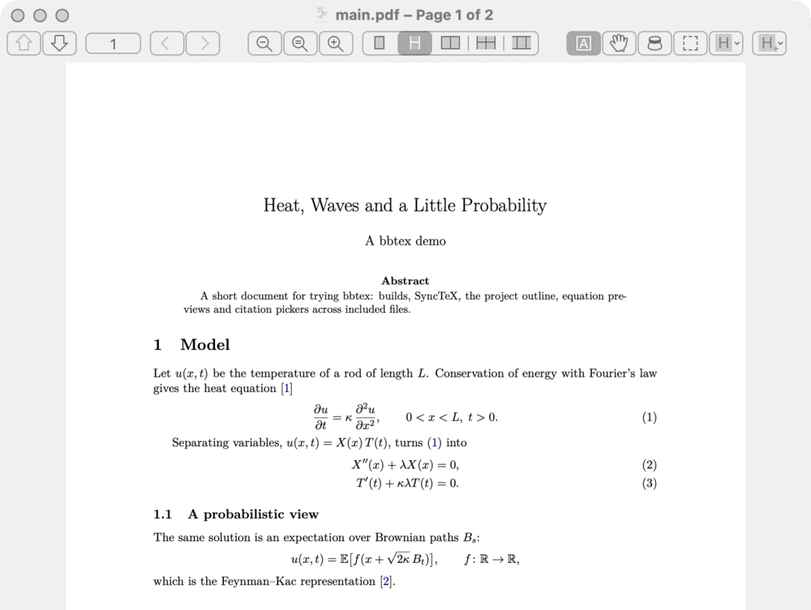
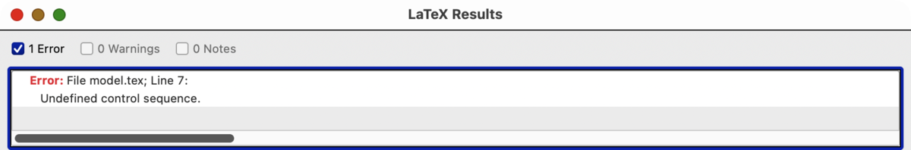
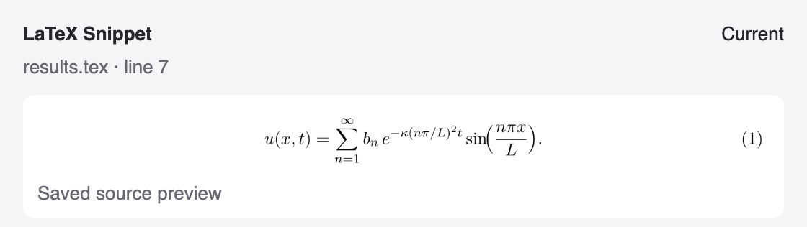

# bbtex

LaTeX package for BBEdit {.subtitle}

**Version:** v0.1.0 · **Platform:** macOS, Apple Silicon · **License:** MIT · **Status:** first release, totally vibe coded {.meta}

I write my papers in BBEdit, and bbtex is the set of LaTeX tools I wanted
there: press <kbd>⌘</kbd><kbd>K</kbd> to build, click an error to land on its
line, jump between the source and the PDF in Skim, and check an equation
without recompiling the whole paper. It lives in BBEdit's **Scripts** menu and
uses BBEdit's own results browser and preview windows, so it should feel like
part of the editor.

New here? Start with [Getting started](getting-started.md).

## What it does

- **Builds.** <kbd>⌘</kbd><kbd>K</kbd> saves the project, runs latexmk
  (pdfLaTeX, XeLaTeX, LuaLaTeX) or Tectonic, and lists errors and warnings in
  the results browser. See [compiling projects](project-builds.md).
- **SyncTeX with Skim.** The PDF follows the cursor without stealing focus;
  ⌘-click in Skim goes back to the source.
- **Equation previews.** Selected math renders with the document's own
  preamble in a small window, on demand, on save, or following the selection.
  See [equation previews](selection-preview.md).
- **Project outline.** Search sections, equations, captions and labels across
  included files and jump there. See [project outline](project-navigation.md).
- **Citations and references.** Pick keys by author, title, year or label
  context. See [the pickers](citation-reference-pickers.md).
- **Environment editing.** Change, toggle or wrap environments in one undo;
  TexLab supplies completion. See [writing and editing](bbedit-editing.md).

## A quick tour

Press <kbd>⌘</kbd><kbd>K</kbd> and Skim opens the PDF where the cursor is:

A broken build lists its errors in BBEdit, one click from the line:

Select an equation to see it rendered with the document's preamble:

## Install

Download `bbtex-macos-arm64.bbpackage.zip` from the
[releases page](https://github.com/LouLouLibs/bbtex/releases), unzip it,
double-click `bbtex.bbpackage`, and run **Scripts → LaTeX — Doctor**. You need
MacTeX (or TinyTeX) and Skim; [Getting started](getting-started.md) covers the
rest, including a source install.

## Totally vibe coded

Every line of bbtex, its tests and these pages was written by an AI coding
agent ([Claude Code](https://claude.com/claude-code)), with me describing what
I wanted and trying it in BBEdit. It is tested fairly hard (unit, cram,
real-engine and native BBEdit checks), but keep your papers in version control
and [open an issue](https://github.com/LouLouLibs/bbtex/issues) when something
looks off. [About bbtex](about.md) has the longer story.
